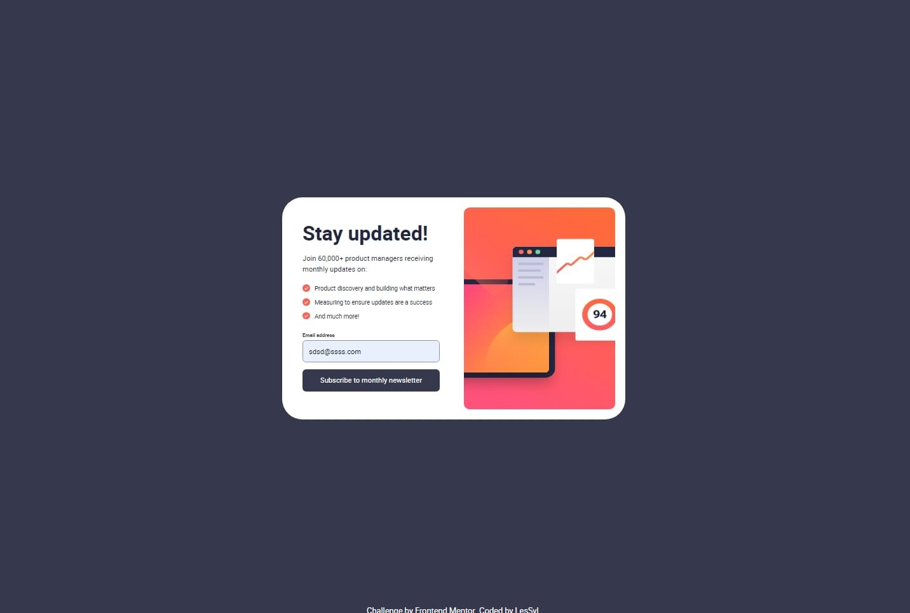
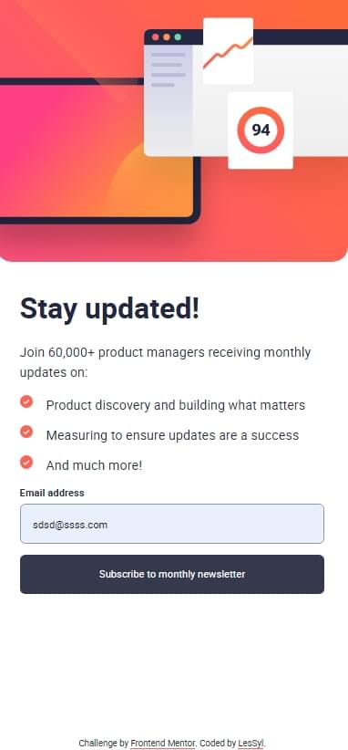

# Frontend Mentor - Newsletter sign-up form with success message solution

This is a solution to the [Newsletter sign-up form with success message challenge on Frontend Mentor](https://www.frontendmentor.io/challenges/newsletter-signup-form-with-success-message-3FC1AZbNrv). Frontend Mentor challenges help you improve your coding skills by building realistic projects. 

## Table of contents
- [Overview](#overview)
  - [Screenshot](#screenshot)
  - [Links](#links)
- [My process](#my-process)
  - [Built with](#built-with)
  - [What I learned](#what-i-learned)
- [Author](#author)

## Overview

### Screenshot

Desktop

Mobile

### Links

- Repository URL:[GitHub](https://github.com/LesSyl/Newsletter-sign-up-form-with-success-message)
- Solution URL: [Frontendmentor]()
- Live Site URL: [Live](https://lessyl.github.io/Frontend-Mentor---Newsletter-sign-up-form-with-success-message/)
## My process

### Built with

- Semantic HTML5 markup
- Mobile-first workflow
- Sass
- BEM
- Flexbox
- JS
- kit

### What I learned

In this challenge, I worked on creating responsive websites, which gave me a better understanding of techniques for adapting a website's appearance to different device resolutions. I also learned how to add my own fonts using @font-face, which gives me more freedom to customise the aesthetics of the site. The main issues I have mastered are methods to prevent the page from reloading, so that the user can use the site smoothly. In addition, I have explored the principles of correct form validation, which allows for effective protection of user data and better management of errors when entering information.

## Author

- Frontend Mentor - [@LesSyl](https://www.frontendmentor.io/profile/LesSyl)
- gitHub - [@LesSyl](https://github.com/LesSyl)
